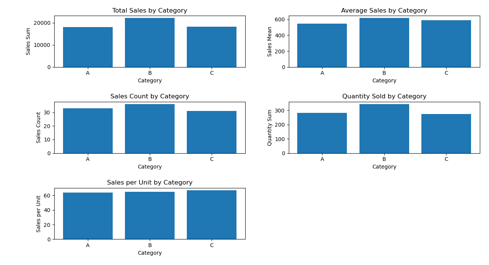

### Findings:
1. Category with highest total sales:
Category B has the highest total sales = 22154
2. Category with highest average sales:
Category B has the highest average sales = 615.39
3. Category with highest sales count:
Category B has the highest sales count = 36
4. Category with highest quantity sold:
Category B has the highest quantity sold = 343
5. Category with highest sales per unit:
Category C has the highest sales per unit = 66.71
6. Weakest category overall:
Category A has the lowest total sales = 18010

----

### Overall Story:
- **Category B** is the strongest category because it has the highest total sales, highest average sales, highest sales count, highest quantity sold, and highest sales per unit.
- **Category A** performs the weakest overall because it has the lowest total sales.