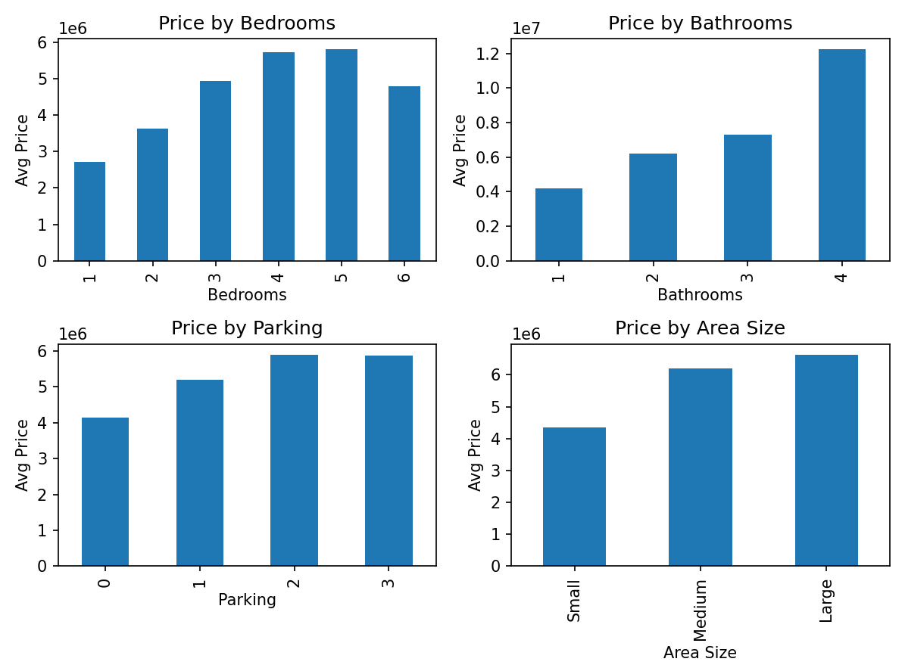
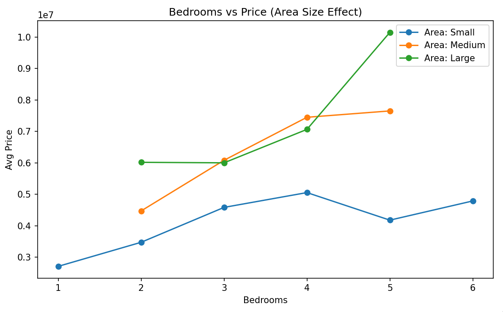

## Housing Prices Datasets:

### Findings:
1. Price generally increases as bedrooms increase, but not always consistent.
2. More bathrooms and parking spaces increase the price.
3. Houses with larger area size have higher average price.
4. Even with same bedrooms, price changes based on area size.
----

### Overall Story:
House price is affected by multiple factors.
Bedrooms, bathrooms, and parking increase price,

but area size also plays a big role.
This shows price is not determined by bedrooms alone.

