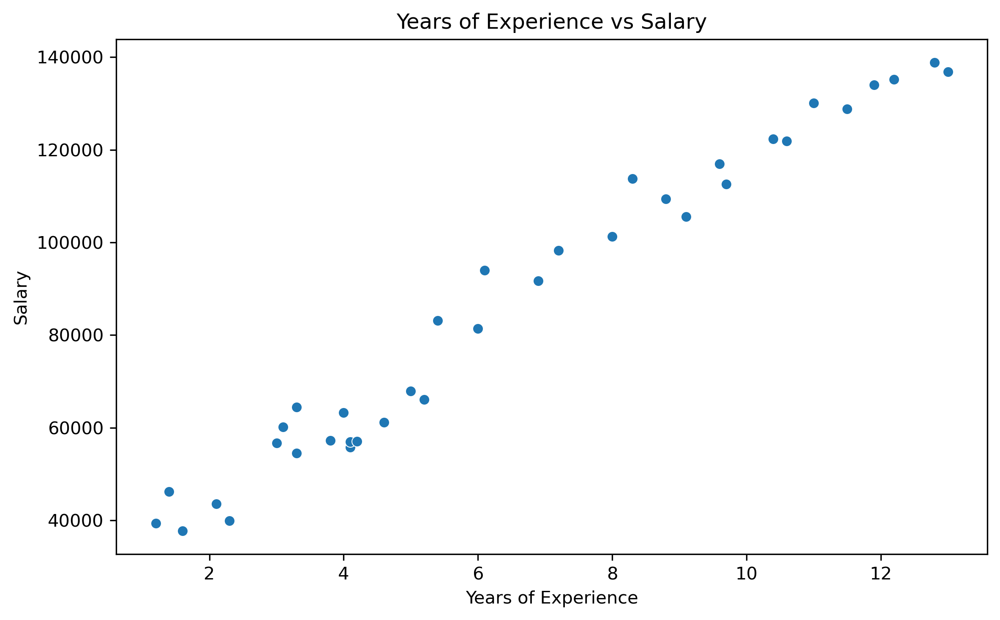
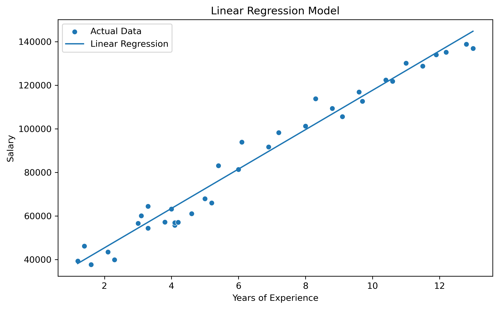
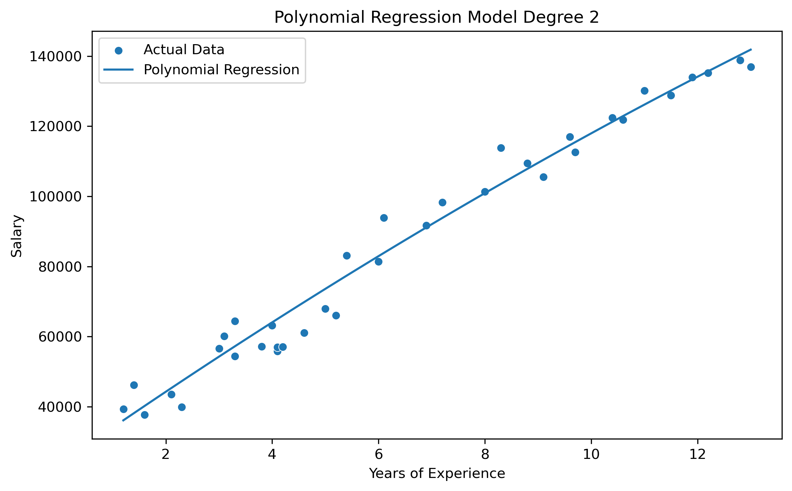
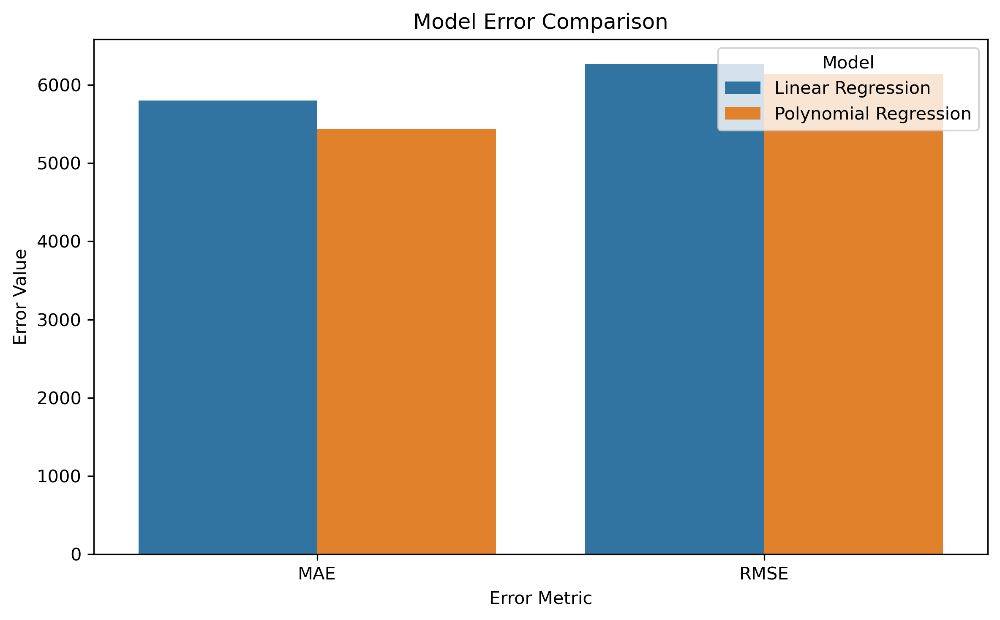
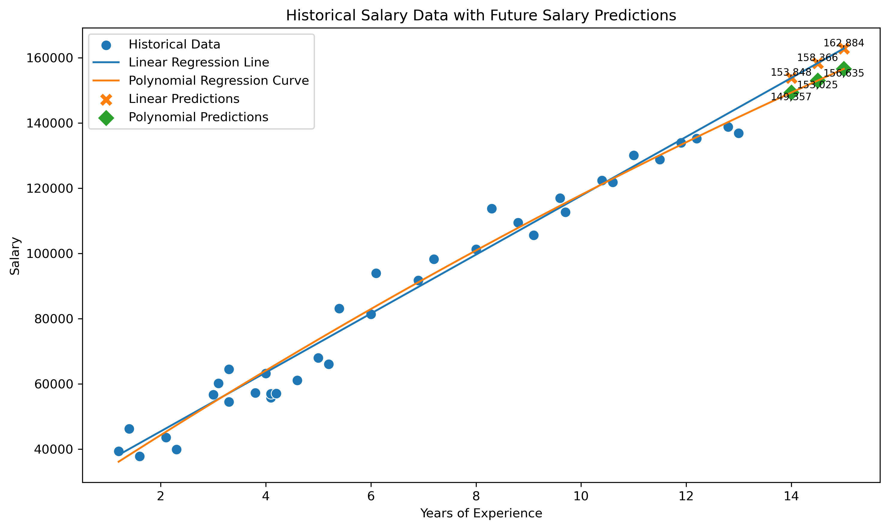

# W10.A1.1 – Linear Regression and Polynomial Regression

## Data Analytics Process

### 1. Data Cleaning and Preprocessing

The salary dataset was loaded into Python using Pandas. Data cleaning was performed before model training to improve data quality and ensure accurate results. The following preprocessing steps were completed:

* Removed unnecessary columns (e.g., `Unnamed: 0`) if present.
* Removed missing values.
* Removed duplicate records.
* Verified that the dataset contained valid numerical values for analysis.

### 2. Feature Selection

The following variables were selected:

| Variable        | Type                     |
| --------------- | ------------------------ |
| YearsExperience | Independent Variable (X) |
| Salary          | Dependent Variable (y)   |

The objective was to predict employee salary based on years of experience.

### 3. Train-Test Split

The dataset was divided into:

* 80% Training Data
* 20% Testing Data

The training dataset was used to train the models, while the testing dataset was used to evaluate model performance on unseen data.

### 4. Linear Regression

A Linear Regression model was developed to learn the relationship between years of experience and salary. The model assumes that salary increases at a constant rate as experience increases and produces a straight-line prediction.

### 5. Polynomial Regression

A Polynomial Regression model (Degree 2) was developed to capture potential non-linear relationships between years of experience and salary. Polynomial features were generated using `PolynomialFeatures(degree=2)` before training the model.

### 6. Model Evaluation

Both models were evaluated using the following error metrics:

* **MAE (Mean Absolute Error)** – Average prediction error.
* **MSE (Mean Squared Error)** – Average squared prediction error.
* **RMSE (Root Mean Squared Error)** – Standard deviation of prediction errors.

The model with the lowest error values was considered the better-performing model.

### 7. Salary Prediction

The trained models were used to predict salaries for:

* 14 years of experience
* 14.5 years of experience
* 15 years of experience

---

# Results

## Model Performance

| Model                 |      MAE |        MSE |     RMSE |
| --------------------- | -------: | ---------: | -------: |
| Polynomial Regression | 5,435.01 | 37,704,200 | 6,140.37 |
| Linear Regression     | 5,802.51 | 39,318,711 | 6,270.46 |

Polynomial Regression performed better than Linear Regression based on RMSE, indicating that it produced more accurate predictions for this dataset.

---

## Salary Predictions

| Years Experience | Linear Regression Salary | Polynomial Regression Salary |
| ---------------: | -----------------------: | ---------------------------: |
|             14.0 |               153,848.08 |                   149,357.36 |
|             14.5 |               158,365.84 |                   153,024.69 |
|             15.0 |               162,883.59 |                   156,635.14 |

The results show that both models predict increasing salary values as years of experience increase. However, Polynomial Regression produced slightly lower salary estimates, reflecting the non-linear relationship learned from the dataset.

---

# Charts

The following charts were generated and saved in the output folder:

## Figure 1. Original Salary Dataset

Shows the relationship between years of experience and salary.

---

## Figure 2. Linear Regression Model

Shows the best-fit straight line generated by the Linear Regression model.

---

## Figure 3. Polynomial Regression Model

Shows the curved trend line generated by the Polynomial Regression model.

---

## Figure 4. Model Error Comparison

Compares the MAE and RMSE values of the Linear Regression and Polynomial Regression models.

---

## Figure 5. Historical Salary Data with Future Predictions

Shows the historical salary data together with future salary predictions for 14, 14.5, and 15 years of experience using both regression models.

---

# Key Findings

* Salary generally increases as years of experience increase.
* Both Linear Regression and Polynomial Regression successfully modeled the relationship between experience and salary.
* Polynomial Regression achieved the lowest RMSE value (6,140.37), indicating better predictive performance.
* The Polynomial Regression model captured a more flexible trend compared to the straight-line assumption used by Linear Regression.
* Linear Regression predicted slightly higher salaries than Polynomial Regression for all future experience values.
* The prediction chart demonstrates that future salary estimates are a continuation of the historical trend observed in the dataset.
* Based on the evaluation metrics, Polynomial Regression is the preferred model for this dataset.
