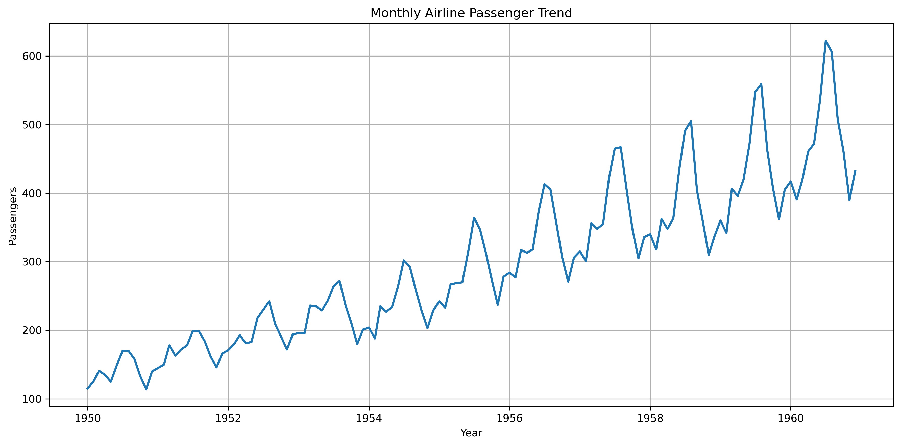
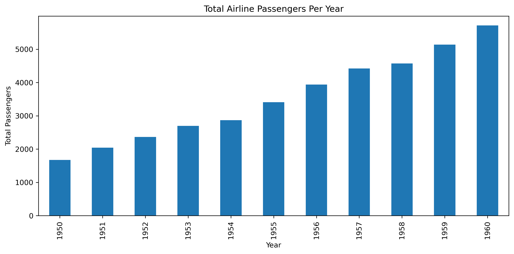
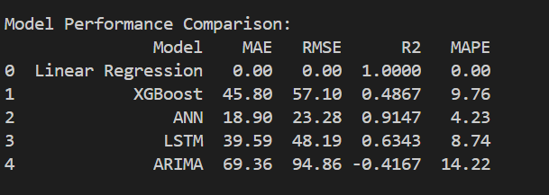
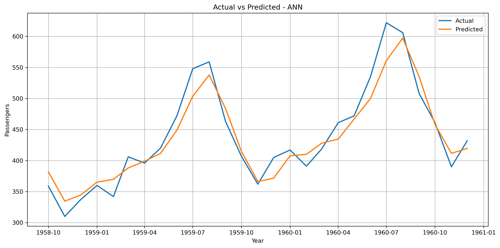

# Week 11 - ML Prediciton Activity
---

**Airline Passenger Demand Prediction Using Machine Learning and Time-Series Forecasting Models**

* Airline Passenger Dataset
* Machine Learning and Time-Series Forecasting
* Linear Regression, XGBoost, ANN, LSTM, and ARIMA

---

## Overview

### Objectives
The goal was to determine which machine learning or forecasting model can best predict future airline passenger demand.

### Dataset
* Monthly airline passenger data
* January 1949 to December 1960
* 144 observations

---

## Data Loading and Preprocessing
* Converted Month column to DateTime format
* Set Month as index
* Checked missing values and duplicates
* Cleaned and prepared the dataset

### Feature Emgineering
* Year
* Month
* Time Index
* Lag 1
* Lag 2
* Lag 3
* Lag 12
* Rolling Mean 3
* Rolling Mean 12

---

## Exploratory Data Analysis

### Monthly Airline Passenger Trend



* Strong upward trend over time
* Passenger demand increased steadily
* Seasonal fluctuations visible each year

---

## Exploratory Data Analysis

### Total Airline Passengers Per Year



* Continuous annual growth
* Increasing airline travel demand
* Consistent rise in total passengers

---

## 6. Prediction Worflow

```text
Load Dataset
      ↓
Preprocessing
      ↓
Feature Engineering
      ↓
EDA
      ↓
Train/Test Split
      ↓
Model Training
      ↓
Prediction
      ↓
Evaluation
      ↓
Model Comparison
```

---

## Models Developed

### Machine Learning Models
1. Linear Regression
2. XGBoost
3. Artificial Neural Network (ANN)
4. Long Short-Term Memory (LSTM)
5. ARIMA

### Evaluation Metrics
* MAE
* RMSE
* R²
* MAPE

---

## Model Comparison Results

### Performance Comparison


---

## Actual vs Predicted Results

### Best Performing Model



Best Performing Model: ANN

RMSE: 23.28
MAE: 18.90
R²: 0.9147
MAPE: 4.23%

Reason:
Lowest prediction errors
Highest explanatory power
Best balance of accuracy and generalisation


## Findings
1. The Artificial Neural Network (ANN) achieved the best valid forecasting performance, producing the lowest RMSE (23.28), lowest MAE (18.90), and highest R² (0.9147).
2. The Artificial Neural Network (ANN) achieved the best valid forecasting performance, producing the lowest RMSE (23.28), lowest MAE (18.90), and highest R² (0.9147).
3. ARIMA produced the weakest performance, with the highest prediction errors and a negative R² value, indicating that it was unable to model the passenger demand patterns effectively.