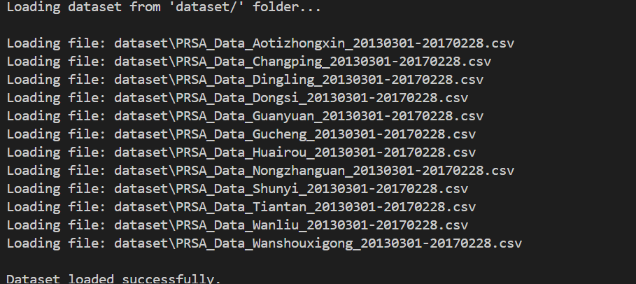
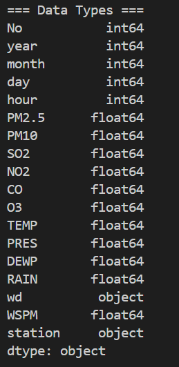
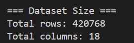

### Week 2 Activity 1 - Beijing Multi-Site Air Quality

This activity performs initial data exploration on the Beijing Multi-Site Air Quality dataset. The goal is to understand the structure of the dataset.

---

## Dataset Description

The dataset consists of multiple CSV files, where each file represents a different air quality monitoring station in Beijing such as Aotizhongxin, Changping, Dongsi.

### Data Structure:
- Each row represents an hourly air quality observation
- Each column represents a variable
---

## Noise Data Handling

During the data preparation stage, some additional files (data.csv, test.csv and an image file) was initially included. However, this file contains are not air quality data.

Since it is not relevant to the Beijing Air Quality dataset, it was excluded from the analysis.

This ensures that:
- Only valid air quality data is used
- The results are accurate and consistent
- No unrelated data affects the analysis

---

## Task 1 Implementation

The following steps were completed:

### 1. Load the Dataset
All CSV files inside the `dataset/` folder were loaded and combined into a single DataFrame using Pandas.

### 2. Display First 5 Rows
Used `df.head()` to preview the dataset and understand its structure.

### 3. Identify Column Names and Data Types
Used `df.info()` and `df.dtypes` to:
- List all columns

- Identify data types (numeric or categorical)

### 4. Count Rows and Columns
Used `df.shape` to determine:
- Total number of rows
- Total number of columns

---

