# Beijing Multi-Site Air Quality Analysis

## Overview
This project analyzes the Beijing Multi-Site Air Quality dataset. The goal is to understand the dataset structure, clean the data, and perform statistical and visual analysis.

---

## Dataset Description

The dataset contains hourly air quality data from multiple monitoring stations in Beijing.

Each file represents one station and includes:
- Time data (year, month, day, hour)
- Pollution data (PM2.5, PM10, SO2, NO2, CO, O3)
- Weather data (TEMP, PRES, DEWP, RAIN, WSPM)

---

## Data Preparation

Some unrelated files were found in the dataset folder. These files were removed to ensure only valid air quality data is used.

---

# Task 1: Load and Inspect the Dataset

The following steps were completed:

### Load the Dataset
All CSV files inside the `dataset/` folder were loaded and combined into a single DataFrame.

---

### 2. Display First 5 Rows
Used `df.head()` to preview the dataset.

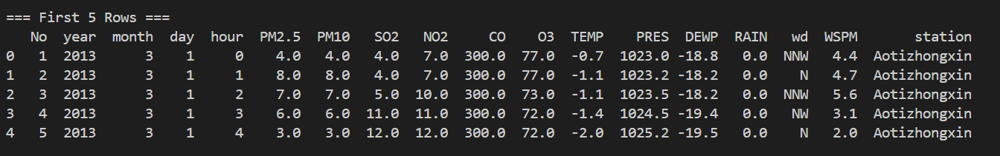

---

### 3. Identify Column Names and Data Types
Used `df.dtypes` to:
- List all columns
- Identify data types

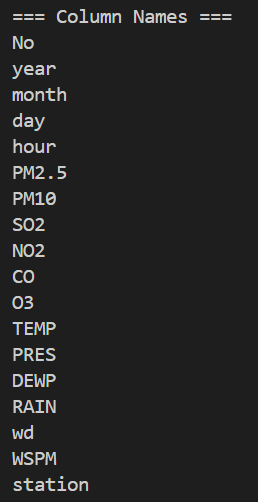

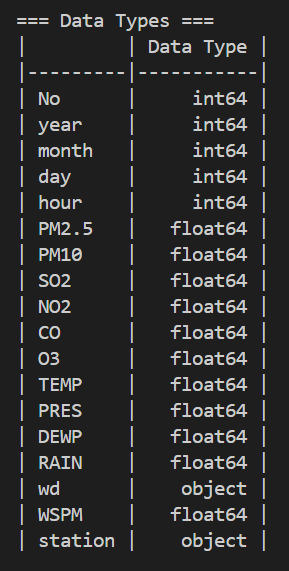

---

### 4. Count Rows and Columns
Used `df.shape` to get dataset size.

---

# Task 2: Data Cleaning

The following steps were completed:

### 1. Identify Missing Values
Running `.isnull().sum()` on the raw combined dataframe revealed the missing values. These were also checked using percentage to understand how much data is missing in each column.

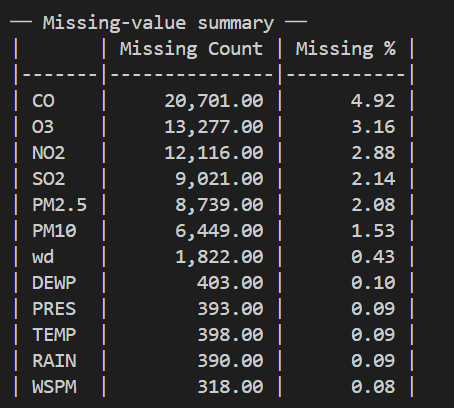

---

### 2. Create Datetime Column
The year, month, day, and hour columns were combined into one datetime column. This creates a proper timestamp, which is important for sorting the data in chronological order by station. It also helps ensure that missing values are filled correctly based on time sequence.

---

### 3. Sort by Station and Time
The dataset was sorted by `station` and `datetime`. This step ensures that each station’s data is arranged in correct time order. Without sorting, missing values might be filled incorrectly using data from another station or wrong time.

---

### 4. Replace Missing Values
Missing numeric values were filled using forward-fill and backfill within each station.

- Forward-fill uses the previous value to fill missing data
- Backfill uses the next value if the missing value is at the beginning

This method is more suitable than using mean or median because air quality data is time-based. Values close in time are more similar than overall averages.

---

### 5. Remove Invalid Rows and Duplicates
After filling missing values:
- Rows with missing pollutant values were removed
- Duplicate rows were removed

In this dataset, no rows were removed for pollutant values because missing values were successfully filled. Some remaining missing values are only in non-critical columns like wind direction.

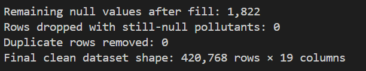

# Task 3: Basic Statistical Analysis

The following steps were completed:

### 1. Calculate Descriptive Statistics
Calculated:
- Mean
- Median
- Minimum
- Maximum
- Standard deviation

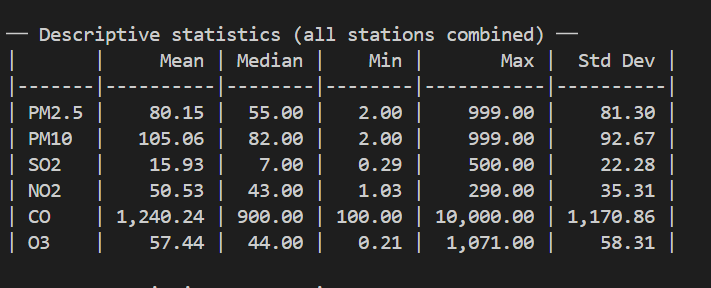

---

### 2. Compare PM2.5 by Station
Grouped data by station and calculated PM2.5 statistics.

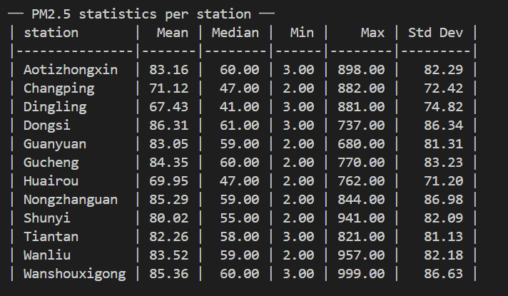

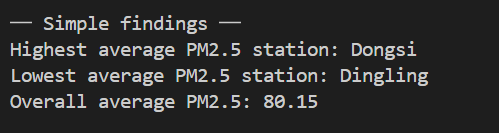

---

# Task 4: Data Filtering

The following steps were completed:

### 1. Calculate Average Pollution per Station
Grouped dataset by station.

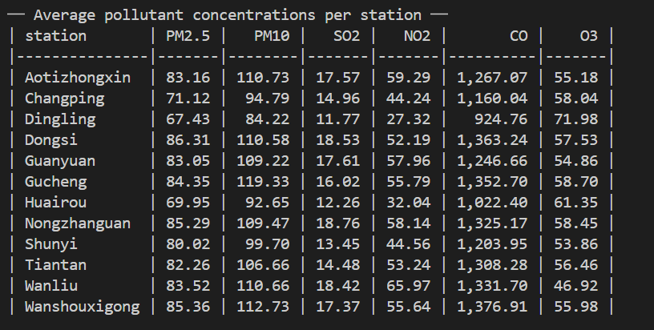

---

### 2. Identify Highest and Lowest Pollution
Found stations with highest and lowest PM2.5.

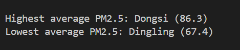

---

### 3. Identify Hazardous Pollution Levels
Counted number of hours where PM2.5 > 150.

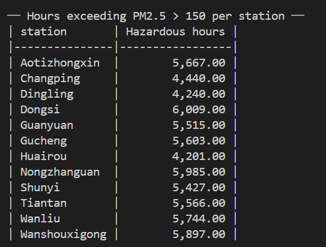

---

# Task 5: Data Visualization

The following graphs were created:

### 1. Histogram of PM2.5
Shows distribution of PM2.5 values.

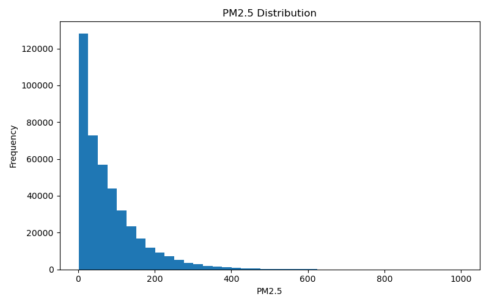

---

### 2. Line Plot of PM2.5 Over Time
Shows monthly trend of PM2.5.

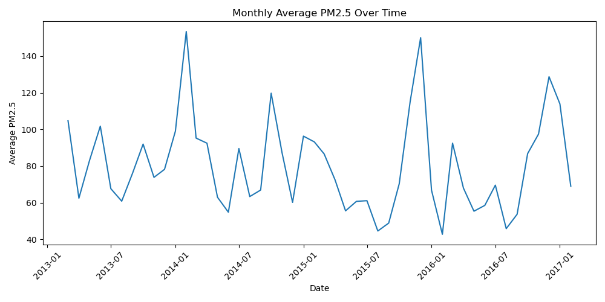

---

### 3. Boxplot of Pollutants
Compares pollutant values.

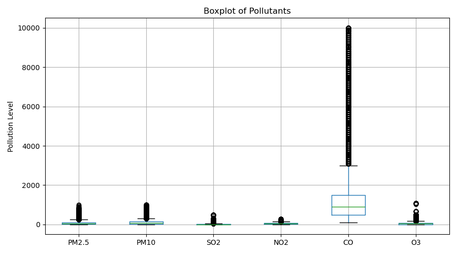

---

#  Task 6: Correlation Analysis

The following steps were completed:

### 1. Calculate Correlation with PM2.5
Checked relationship between PM2.5 and other variables.

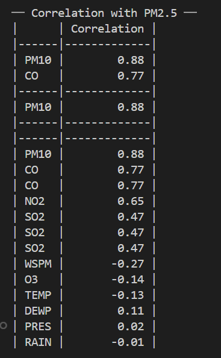

---

### 2. Identify Most Related Variable
Found the variable with strongest correlation.

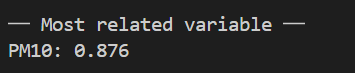

---

### 3. Analyze Temperature Effect
Checked how temperature affects PM2.5.

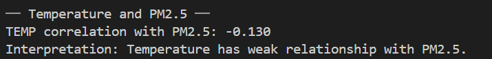

---

# Key Findings

- PM2.5 levels show high variation across the dataset, with some very high values observed. This indicates that air pollution can reach unhealthy levels at certain times.
- Most pollutant variables such as PM10, NO2, and CO show a positive relationship with PM2.5. This suggests that when one pollutant increases, others also tend to increase.
- Pollution levels vary across different stations, showing that some locations have higher average pollution than others. This indicates that location plays an important role in air quality.
---