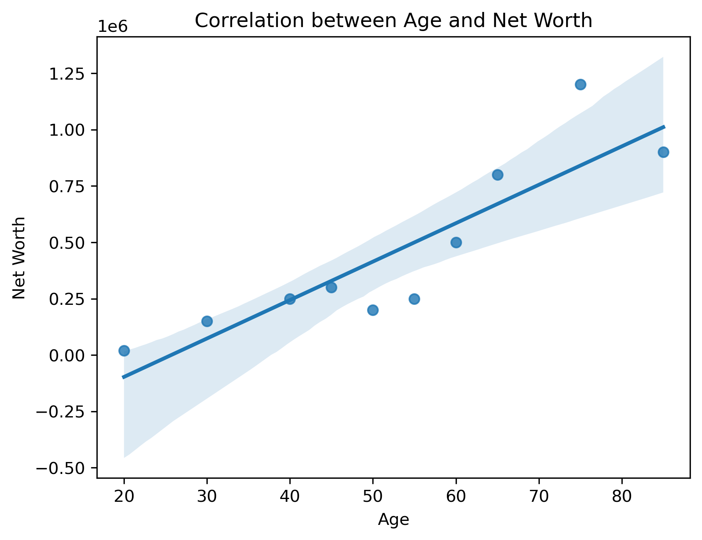

## Week 3 - Activity 1: Calculate the correlation between two features

`Correlation between Age and Net Worth: 0.88`

### Findings

  

- Positive Relationship Between Age and Net Worth - Net worth generally increases as age increases, indicating a positive correlation.
- Wealth Builds Over Time - Older individuals tend to have higher net worth, suggesting that wealth accumulation happens gradually through income and investments.
