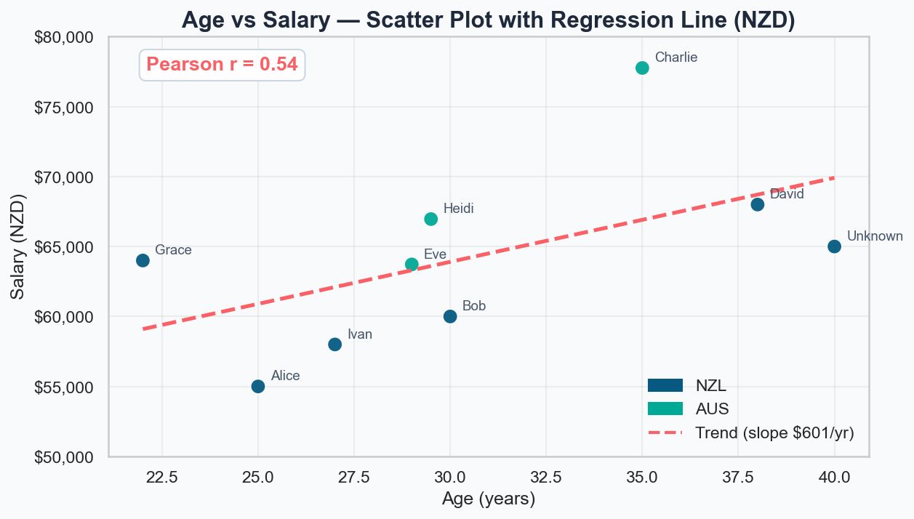
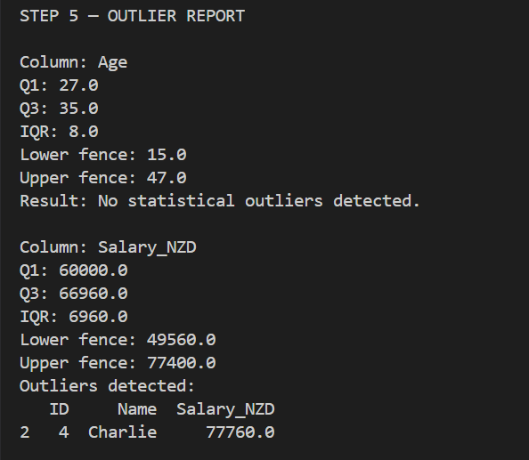

## Week 3 - Activity 2: Data Cleaning and Data Visualization with correlation heatmap- Pearson algorithm

### Overview

This project analyzes the relationship between Age and Salary using a messy dataset. The process includes data cleaning, correlation analysis, and outlier detection.

### Data Preparation
- **Data Scrubbing** - Converted text values in age and salary into numbers, merged duplicate IDs, and fixed invalid date formats.
- **Data Munging** - Standardized country codes, cleaned name formatting, and ensured correct data types for numeric fields.
- **Data Wrangling** - Filled missing values, converted Australian salaries to NZD, created tenure in years, and added outlier detection using the IQR method.

  

### Salary Distribution, Trends and Correlation Heatmap

  
  
  

  
  

  

### Outlier Report

  
  

**Outlier detected after currency conversion**
One statistical outlier was identified in salary:

Charlie ($77,760 NZD) is slightly above the upper fence ($77,400)
However, this outlier is caused by currency conversion (AUD → NZD) rather than an unusually high original salary. This means the value is not truly abnormal but is an effect of data transformation.

### Top 3 Key Findings:

1. **Age has a moderate positive relationship with salary (r = 0.54)** - There is a moderate positive correlation (r = 0.54) between age and salary (in NZD), indicating that older employees generally earn more. On average, salary increases by approximately $601 NZD per year of age, showing a clear upward trend, although the relationship is not very strong.

2. **Grace (22) is an exception to the trend** - Although younger employees usually earn less, Grace (22) earns $64,000 NZD, which is $2,720 above the average salary of employees aged 30 and under ($61,280 NZD). She earns more than several older employees, showing that salary is influenced by other factors such as skills or role, not just age.

3. **Tenure has no meaningful relationship with salary (r = -0.12)** - The correlation between tenure and salary is very weak and slightly negative (r = -0.12), meaning that years of service do not increase salary. In some cases, employees with longer tenure may even earn less than newer employees, suggesting that tenure is not a key factor in salary decisions..

