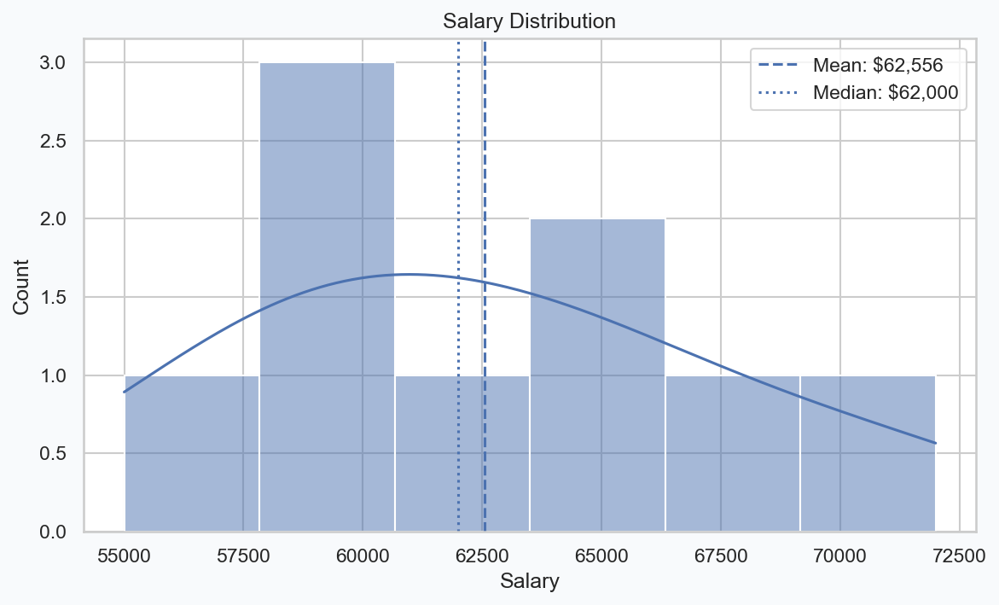
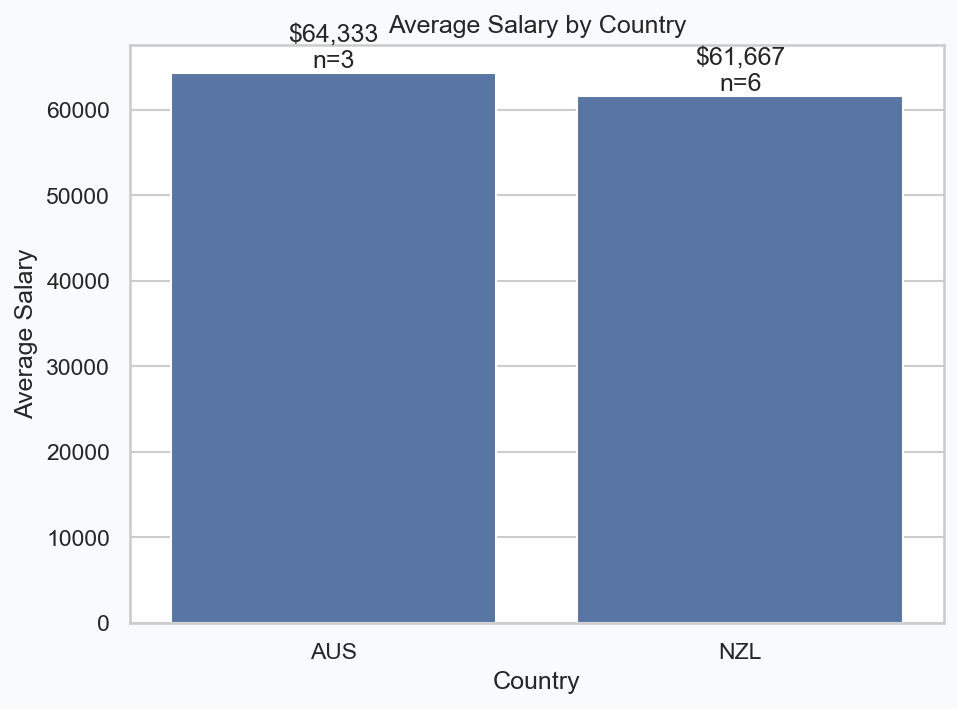
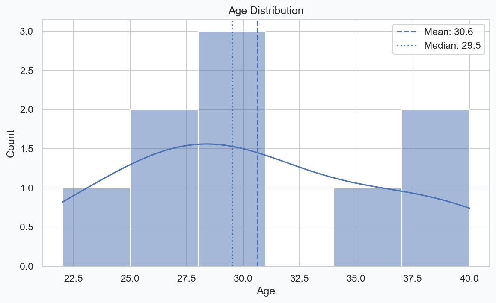
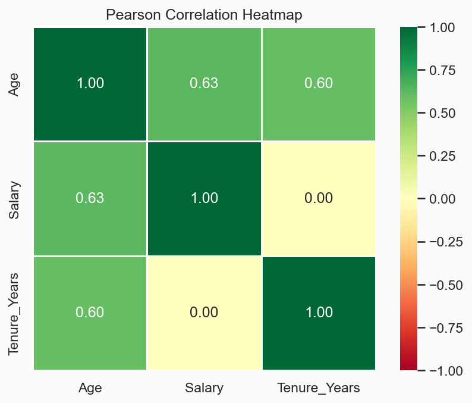
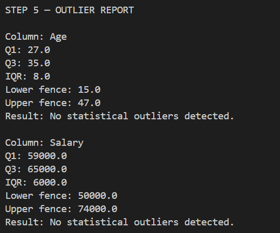
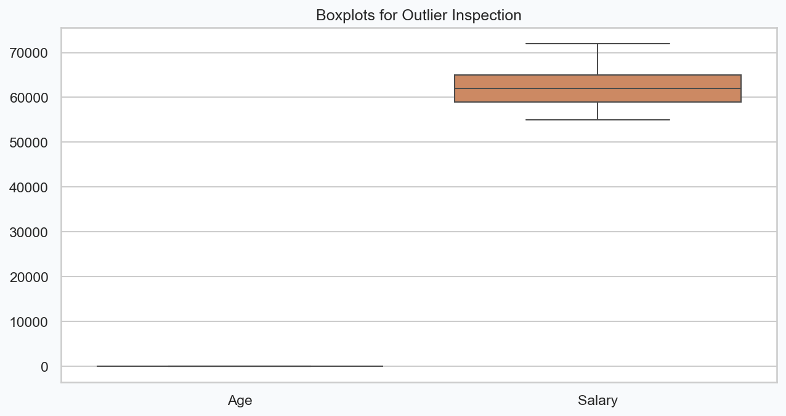

## Week 3 - Activity 2: Data Cleaning and Data Visualization with correlation heatmap- Pearson algorithm

### Overview

This project analyzes the relationship between Age and Salary using a messy dataset. The process includes data cleaning, correlation analysis, and outlier detection.

### Cleaned Data

### Salary Distribution, Trends and Correlation Heatmap

  
  
  

  
  

### Outlier Report

  
  

### Findings:

