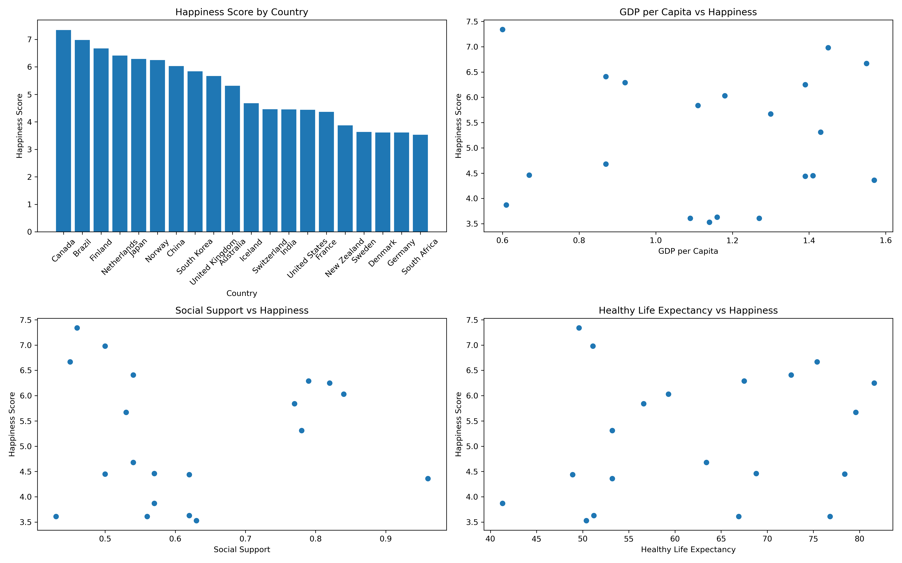
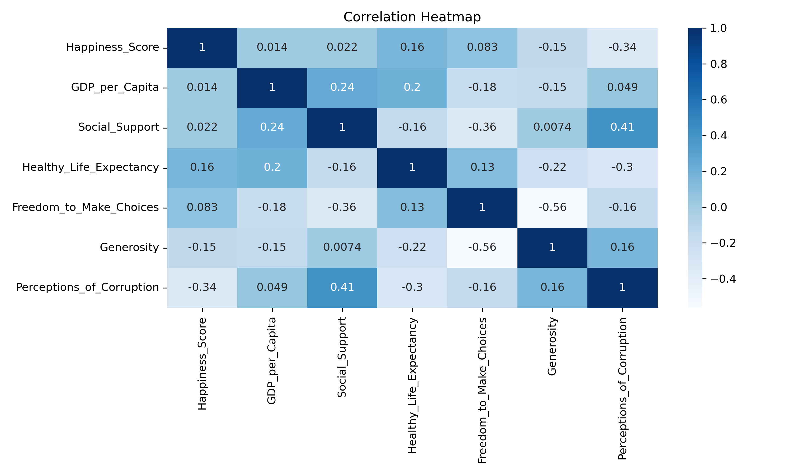

## Week 4 Activity 1 : Data Visualization

This activity focuses on data cleaning, visualization and analysis using the World Happiness dataset.

----

### Dataset Overview
The dataset contains information about happiness levels across different countries.
Each row represents one country, and each column shows a factor that may affect happiness.

Type: Cross-sectional data (no time series)
Unit of analysis: Country
Number of records: 21
Number of variables: 8

**Key Columns**
- Happiness_Score – overall happiness level
- GDP_per_Capita – economic condition
- Social_Support – support from family/community
- Healthy_Life_Expectancy – health level
- Freedom – ability to make choices
- Corruption – trust in government

## Purpose
- To analyze what factors affect happiness
- To compare countries based on well-being

### Data Cleaning Process
- No missing data issues
- No incorrect data types
- Minimal cleaning required
- Dataset is already clean and reliable for analysis

### Visualisation

  

- **Happiness Score by Country** - This graph shows the happiness score of each country. Canada has the highest score, while South Africa has the lowest. Happiness levels are different across countries.

- **GDP per Capita vs Happiness** - This graph shows the relationship between GDP and happiness. Countries with higher GDP usually have higher happiness scores. Economy may affect happiness.

- **Social Support vs Happiness** - This graph shows the relationship between social support and happiness. Countries with stronger social support often have higher happiness scores. Support from family and community may improve happiness.

- **Healthy Life Expectancy vs Happiness** - This graph shows the relationship between health and happiness. Countries with longer healthy life expectancy usually have higher happiness scores. Better health may lead to better well-being.

  

The heatmap shows the correlation between the variables using numbers from -1 to 1. Values closer to 1 means strong positive relationship, while values closer to -1 means strong negative relationship. In this graph, Freedom to Make Choices and Generosity has the strongest negative relationship with -0.56. Social Support and Perceptions of Corruption have moderate positive relationship with 0.41. Happiness Score has weak relationship with most variables because the values are close to 0, like GDP per Capita with 0.014 and Social Support with 0.022.

### Findings:
-  Happiness is affected by many factors. GDP, social support, and health all help improve happiness. No single factor fully determines happiness.
