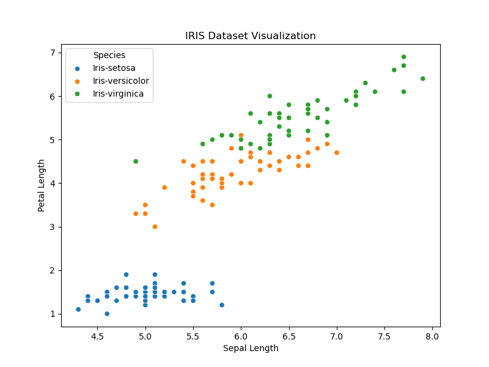
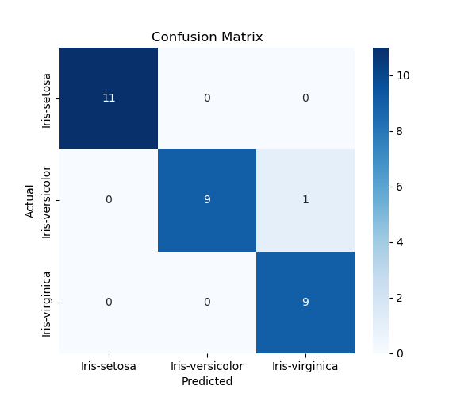
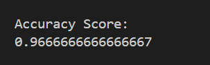
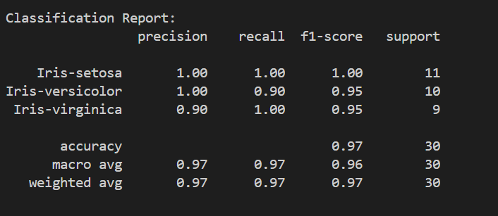

# Week 6 Activity 1 – SVM Classification using IRIS Dataset

## Description
This activity uses the IRIS dataset to perform flower classification using the Support Vector Machine (SVM) algorithm with a linear kernel.

The project includes:
- Loading and cleaning the dataset
- Data visualization
- Training the SVM classifier
- Predicting flower species
- Evaluating model accuracy

## Steps Performed
1. Loaded the IRIS dataset from CSV
2. Removed unnecessary columns
3. Checked missing values
4. Split dataset into training and testing sets
5. Trained SVM model using linear kernel
6. Predicted flower species
7. Evaluated model performance using:
   - Accuracy Score
   - Classification Report
   - Confusion Matrix

## Train and Test Split

The dataset was divided into training and testing datasets using `train_test_split()` from Scikit-learn.

```python
test_size=0.2
```

This means:
- 80% of the dataset is used for training
- 20% of the dataset is used for testing

IRIS dataset contains 150 rows:
- Training dataset: 120 rows
- Testing dataset: 30 rows

The random state value `42` is used so the result will stay same every time the program runs.

## Result
The model achieved high classification accuracy on the testing dataset.

<p align="center">
  
</p>

<p align="center">
  
</p>

<p align="center">
  
</p>

- This means the model correctly predicted most flower species from the testing dataset.

<p align="center">
  
</p>

### Classification Report Result Explanation

The SVM model performed very well in classifying the flower species from the IRIS dataset.

### Iris-setosa
- Precision: 1.00
- Recall: 1.00
- F1-score: 1.00

This means the model perfectly classified all Iris-setosa flowers in the testing dataset without any errors.

### Iris-versicolor
- Precision: 1.00
- Recall: 0.90
- F1-score: 0.95

This means all flowers predicted as Iris-versicolor were correct. However, the model missed a small number of actual Iris-versicolor flowers during prediction.

### Iris-virginica
- Precision: 0.90
- Recall: 1.00
- F1-score: 0.95

This means the model successfully identified all Iris-virginica flowers, but a few predictions labeled as Iris-virginica actually belonged to another class.

### Overall Accuracy
The model achieved 97% accuracy on the testing dataset, which means most flower species were classified correctly.

The weighted average and macro average scores are also very high, showing that the model performed consistently across all flower classes.
