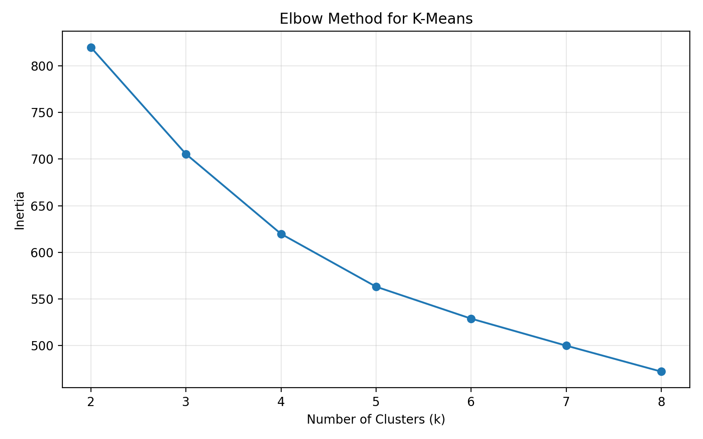
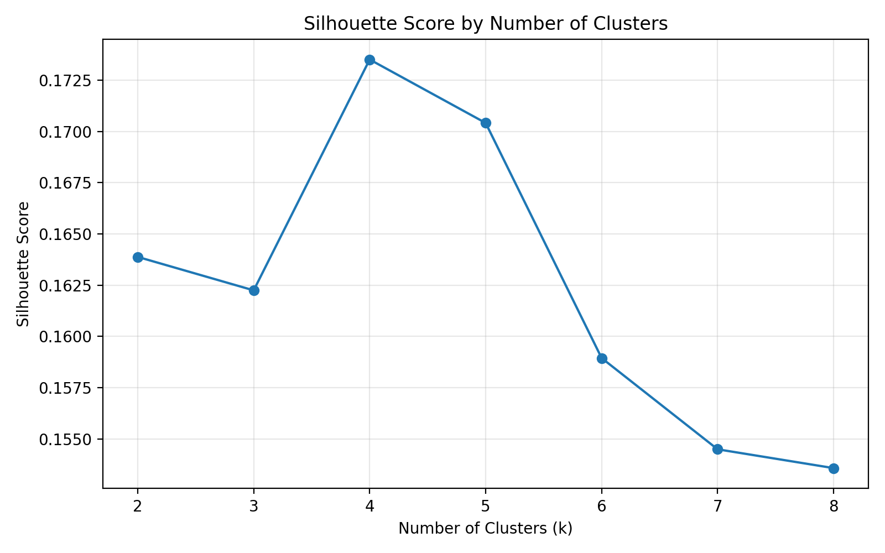
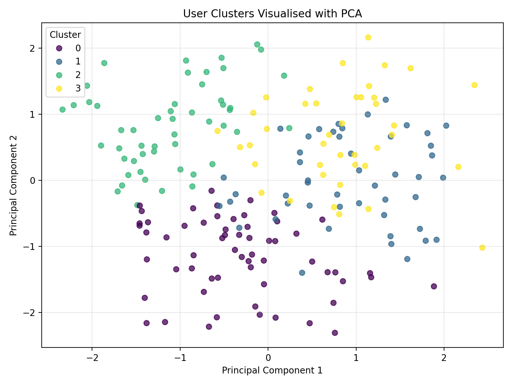
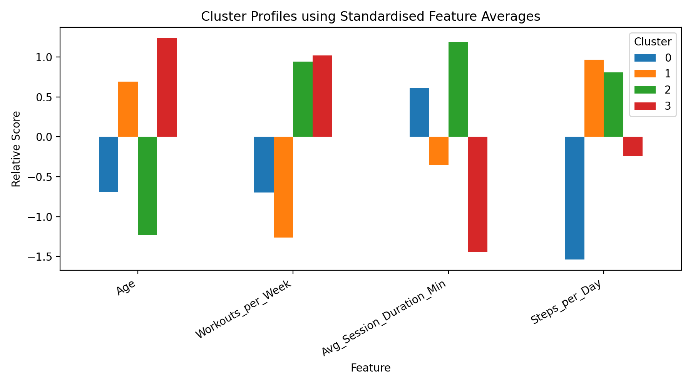
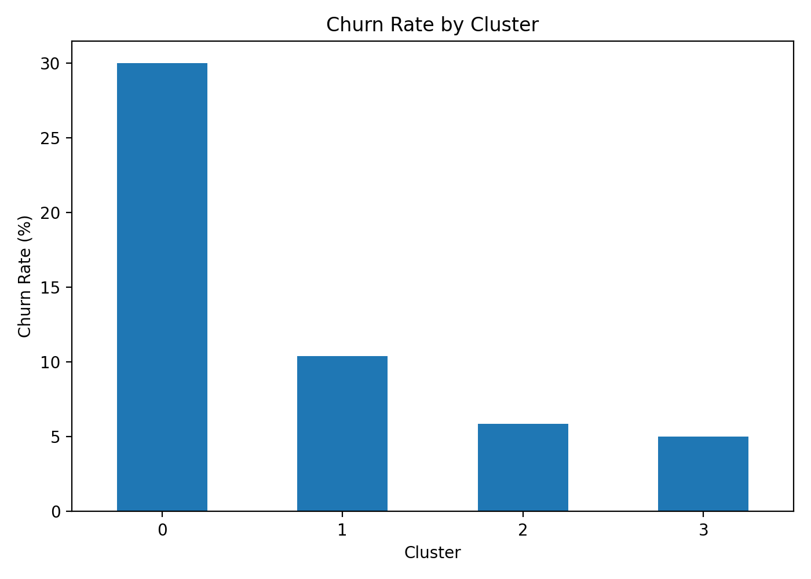

# Fitness App User Clustering Analysis

## Overview

This activity performs data cleaning and clustering analysis on a Fitness App User dataset containing 200 user records. The objective is to identify groups of users with similar fitness behaviours using machine learning techniques and generate insights that can support user engagement and retention strategies.

The activity includes:

* Data cleaning and preprocessing
* Feature selection
* K-Means clustering
* Optimal cluster selection using Elbow Method and Silhouette Analysis
* Cluster interpretation
* Data visualisation
* Business insights and recommendations

---

## Dataset

**File:** `Fitness_App_User_Data.xlsx`

The dataset contains user demographic information and fitness activity metrics such as age, workout frequency, session duration, and daily step counts.

---

## Data Cleaning Process

Several preprocessing steps were performed before clustering.

### Missing Values

Missing values were identified and handled as follows:

* Numerical columns were filled using the median value.
* Categorical columns were filled using the most frequent value.

### Duplicate Records

Duplicate records were checked using:

```python
df.duplicated().sum()
```

Result:

* Total records: 200
* Duplicate records found: 0

Therefore, no rows were removed during duplicate cleaning.

### Data Type Validation

All clustering features were converted to appropriate numeric data types to ensure compatibility with machine learning algorithms.

### Feature Scaling

StandardScaler was applied to standardise the numerical features before clustering. This prevented variables with larger numerical ranges from dominating the clustering process.

---

## Features Used for Clustering

The following features were selected because they represent user fitness activity and engagement levels:

* Age
* Workouts_Per_Week
* Avg_Session_Duration_Min
* Steps_per_Day
* Gender
* Subscription_Type

---

## Clustering Methodology

### K-Means Clustering

K-Means clustering was used to segment users into groups with similar behavioural patterns.

The algorithm was evaluated using cluster values ranging from:

```text
K = 2 to K = 8
```

### Cluster Evaluation Metrics

The following methods were used to determine the optimal number of clusters:

#### Elbow Method

The Elbow Method measured inertia (Within-Cluster Sum of Squares) for different K values.

The graph showed a substantial reduction in inertia up to K=4, after which improvements became less significant.



#### Silhouette Analysis

Silhouette Score was calculated for each K value.

The highest score occurred at:

```text
K = 4
```




### Final Cluster Selection

Based on both the Elbow Method and Silhouette Analysis, the optimal number of clusters was determined to be:

```text
K = 4
```

---

### PCA Cluster



- Four distinct user segments were identified.
- Users within the same cluster exhibit similar fitness behaviours.
- Some overlap exists, indicating certain users share characteristics across clusters.
- The clustering model successfully separated users into meaningful groups.

### Cluster Profile

- Cluster 2 contains the most active users with high workouts, longer sessions, and more daily steps.
- Cluster 0 shows the lowest activity levels and engagement.
Cluster 3 contains older users who exercise frequently.
- User behaviour varies significantly across the four clusters.

### Churn Rate by Cluster

- Cluster 0 has the highest churn rate (~30%).
- Clusters 2 and 3 have the lowest churn rates (~5–6%).
- More active users tend to have lower churn.
- Retention efforts should focus on users in Cluster 0.


## Key Findings
1. Four distinct user segments were identified.
2. Cluster 0 exhibited the highest churn rate (30%).
3. Clusters 2 and 3 demonstrated the strongest engagement levels.
4. Workout frequency and daily step count appear to be important indicators of user retention.
5. Highly engaged users are less likely to leave the platform.


